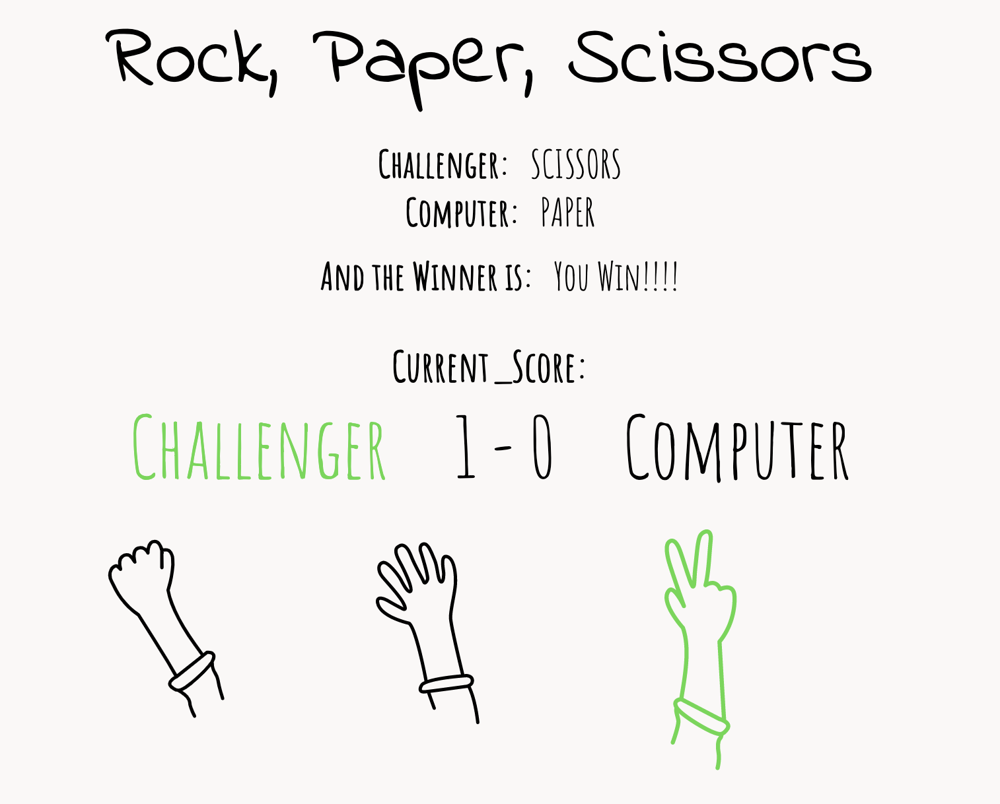

# rock_paper_scissors

 A simple rock, paper, scissors game.
 Languages Used:  HTML / CSS / JavaScript

View the application [here](https://jmurrii.github.io/rock_paper_scissors/)

## Summary
In the Fourth exercise of Andy Sterkowitz' Software Development Mastermind Program, I was given the task of creating a rock, paper, scissors game.
The project required me to learn about eventHandlers, setTimeout function and introduced my to the ideas of synchronous and asynchronous javascript.
I also tried to incorporate some CSS effects with hover on the SVG icons, and a green font to record who is winning the game.

## Author
John Murray - _Software Developer_
